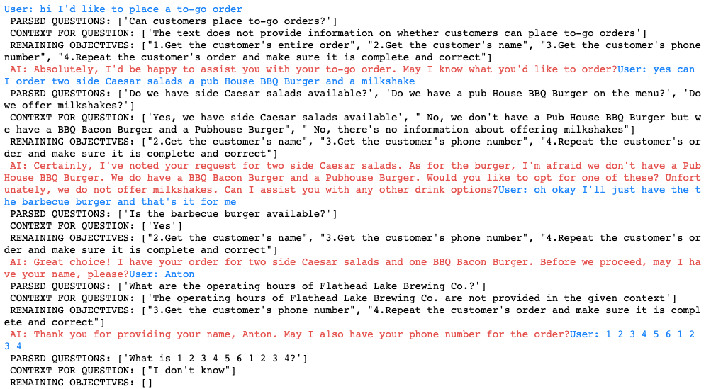
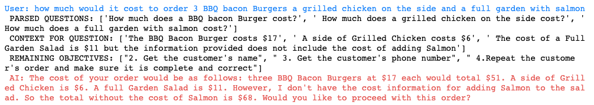
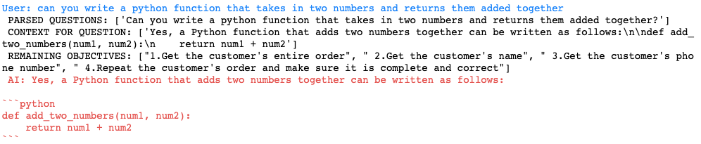
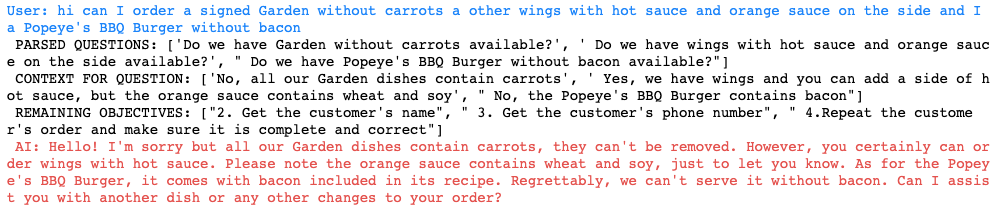

# HostGPT Agent Execution:
The agent is initialized with a personality, a use case (where I work in my case), and a set of objectives to meet.

It then enters a while loop that only ends when the set of objectives have all been met. First it waits for user audio input, which is translated with Google Speech and parsed for questions with an OpenAI function. Vector embeddings are created from these questions, which are queried with my existing knowledge base in pinecone and summarized by another OpenAI function call (when I didn't include this question-answering call the conversation model had a difficult time answering the questions and continuing the conversation effectively). 

The output by the conversation model is translated into audio with Google's texttospeech, and the loop continues with (hopefully) one less remaining objective.

# Version 1 of HostGPT

I was surprised about the effectiveness of using OpenAI functions as information extractors, which made the while loop and question parsing/answering possible.
It is however, too slow to work in a real-time phone call (4-8 seconds per response). I didn't use GPT-3.5-turbo because I disliked its outputs for this use case. In conversation, it was too long and repetitive, and it wouldn't consistently follow the function calling prompts. This could probably be improved with better prompting and would be necessary to get speed improvements.

This model is possibly generalizable to any QA interaction with definable objectives, but I have yet to try.

From working in a restaurant, I know that customers oftentimes ask weird and unpredictable questions and I would like HostGPT to ask for employee input (just an input() call in this project) when these questions come up.

### Success Cases:

The model does a great job with simple questions, such as whether an item exists on the menu and handles unknown menu items perfectly. The model recognizes when an objective was met, and ends execution appropriately.

It does a good job parsing each item and does the math for me. I would like to try langchain's PALChain for this type of question to ensure accuracy.

### Limitations/Failure Cases:
The model doesn't properly handle substitution/removal requests. This probably just needs database improvements with longer explanations about what's possible.

As seen in some of the images, the PARSED_QUESTIONS are sometimes irrelevant. I think adding a window memory for the last 1-2 messages would help it understand the context of the question, as right now it is only passed in what the user just said.

If you refuse to give your name/number, the model agrees with your privacy concerns and doesn't ask again, but the objective isn't met and the loop continues 

Asking for lists of a type of item fails because my queries only return the top k matches, which may not include everything. Manually adding these types of answers into the database would fix this.

Sometimes the agent will catch them, but typically if the question is picked up by PARSED QUESTIONS the agent will respond with the answer even if it is unrelated.

Google speech heard 'Pubhouse burger' as 'Popeyes burger' and the model used the user's pronunciation instead of the text from the database.
